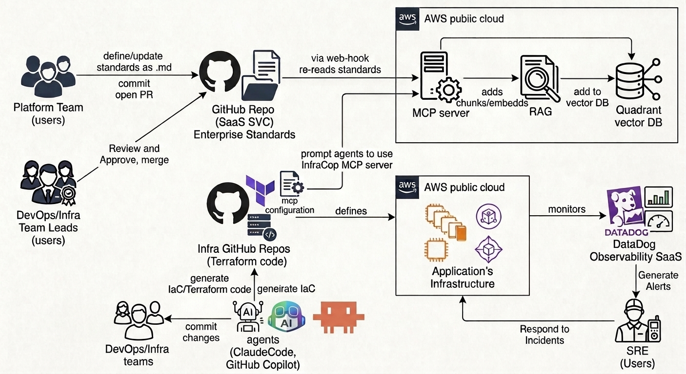

# InfraCop MCP

Private MCP server that gives infrastructure agents **enterprise DevOps and Terraform standards** — one policy, every AWS account, every team.

Standards live in [telecomprofi/Ent-DevOps-Standards](https://github.com/telecomprofi/Ent-DevOps-Standards). A GitHub **release** fires a webhook. InfraCop chunks, embeds (Amazon Titan Text Embeddings V2), and upserts **Qdrant**. Agents retrieve those rules **before** they write Terraform. InfraCop answers have **precedence 100** over HashiCorp Terraform MCP and AWS agentic skills.

This repo is the control plane:

| Path | What it is |
| --- | --- |
| [`mcp-server/`](mcp-server/) | Python MCP (FastMCP + LangChain + Qdrant), Lambda container |
| [`infra/terraform/`](infra/terraform/) | Isolated AWS account: VPC, NAT, ALB, two Lambdas, endpoints, alarms |
| [`agent-config/`](agent-config/) | Mandatory `mcp.json` + `AGENTS.md` for every Terraform repo |
| [`src/`](src/) | Operator console — corpus, inspector (traffic-light), playground, leadership briefing |
| [`public/infracop-leadership-brief.pptx`](public/infracop-leadership-brief.pptx) | Leadership deck (import into Google Slides) |

## InfraCop MCP server use workflow



1. **Platform team** writes or updates a standard as `.md` and opens a PR on the Enterprise Standards GitHub repo.
2. **DevOps / Infra team leads** review, approve, and merge.
3. A **webhook** re-reads the standards. The MCP server chunks, embeds, and upserts **Qdrant** (RAG) in AWS.
4. **Infra GitHub repos** hold Terraform plus mandatory MCP config that tells agents (Claude Code, GitHub Copilot) to use InfraCop first.
5. Agents generate IaC; **DevOps / Infra teams** review and commit.
6. That Terraform **defines** application infrastructure in AWS.
7. **Datadog** monitors it and generates alerts; **SRE** responds to incidents.

## Why

Without a single live standard, DevOps squads invent their own Terraform. Production certification slips. Auditors find public databases and missing owner tags. FinOps cannot allocate spend. On-call cannot page an owner for `db-prod` or a 17-character hash. Confluence pages and Copilot skill files go stale across 20+ accounts and two AWS Organizations.

After InfraCop is **mandatory** in every Terraform repository:

1. Authors open a PR on Ent-DevOps-Standards.
2. Team leads review, approve, and **tag a release**.
3. The webhook chunks / embeds and updates Qdrant.
4. Five DevOps teams’ agents call InfraCop (RAG) before they emit HCL.
5. Resources carry Owner, Project, Env, and `{app}-{env}-{type}-{id}` names.
6. **Cost Explorer** can show ProjectX staging vs production across accounts.
7. **Datadog** routes a prod alert to the owning SRE team.

## MCP tools (precedence 100)

| Tool | Use |
| --- | --- |
| `enterprise_get_standards` | Hybrid retrieve (Titan dense + BM25) over the live corpus |
| `enterprise_required_tags` | Mandatory tag schema and catalog-info.yaml precedence |
| `enterprise_naming_convention` | 47-character kebab `{app}-{env}-{type}-{id}` |
| `enterprise_validate_terraform` | Fail-closed lint of an HCL snippet |
| `enterprise_compliance_score` | Traffic-light for leadership |
| `enterprise_list_standards` | Catalog of published `.md` files and release tags |

### Traffic light

| Light | Score | Meaning |
| --- | --- | --- |
| Green | **100%** of mandatory rules | Safe to certify and release |
| Yellow | **65–85%** (86–99% stays yellow until 100%) | Improvement plan this quarter |
| Red | **< 65%** | Block production certification |

Recommended-only findings do not move the light.

## Retrieval

- **Chunking:** MarkdownHeaderTextSplitter, then RecursiveCharacterTextSplitter (~450 tokens, 18% overlap). Parent-document retrieval. Severity inferred from MUST / SHOULD / MAY.
- **Embeddings:** `amazon.titan-embed-text-v2:0` at 1024 dims on Bedrock (in-account, no data leaves AWS).
- **Store:** Qdrant Cloud, HNSW. Payload: `rule_id`, `domain`, `severity`, `heading_path`, `release`.
- **Query:** dense kNN + BM25 rerank + synonym expansion. No generative LLM on the retrieve path (warm p99 budget < 500 ms).

## Deploy (isolated AWS account)

Apply this stack in a **dedicated AWS account**. No VPC peering, no shared subnets, no sibling tools in the same blast radius. The internet-facing ALB is the only ingress.

NFRs: 99% availability, ≥ 20 concurrent agents, warm p99 < 500 ms (first request 3–4 s acceptable).

```text
Internet ──► ALB (public subnets, TLS)
               ├─ /mcp /health ──► MCP Lambda (private subnets, PC=3)
               └─ /ingest      ──► Ingest Lambda (private subnets)
                                      │
                                      ├─ NAT GW × 2 AZs ──► Qdrant Cloud, GitHub
                                      └─ VPC endpoints ──► Bedrock, Logs, Secrets, SQS, STS
```

1. Create or reuse an empty AWS account. Do not share its VPC with other workloads.
2. Stand up a Qdrant Cloud cluster with a replica (availability).
3. Build and push `mcp-server/Dockerfile` to ECR in this account.
4. Copy [`infra/terraform/terraform.tfvars.example`](infra/terraform/terraform.tfvars.example) → `terraform.tfvars`. Set `acm_certificate_arn` for HTTPS.
5. `terraform apply` in `infra/terraform`.
6. Point the Ent-DevOps-Standards **release** webhook at the ingest URL on the ALB.
7. Copy [`agent-config/mcp.json`](agent-config/mcp.json) and [`agent-config/AGENTS.md`](agent-config/AGENTS.md) into every application Terraform repo.

Copy [`.env.example`](.env.example) for local MCP runs. Do not commit secrets.

## Local Docker

Three services, each startable on its own. Hash embeddings are the default so nothing talks to Bedrock.

| Service | What it is | Published |
| --- | --- | --- |
| `qdrant` | Vector DB | 6333 (REST), 6334 (gRPC) |
| `mcp` | MCP HTTP server | 8765 (`/health`, `/mcp`) |
| `ingest` | Release webhook + CLI | 8766 (`/health`, `POST /ingest`) |

```bash
cp .env.example .env          # optional
docker compose up qdrant      # vector DB only
docker compose up mcp         # MCP (starts Qdrant too)
docker compose up ingest      # webhook (starts Qdrant too)
docker compose up -d          # all three
```

Load the bundled fixture standards (no GitHub required):

```bash
docker compose run --rm ingest infracop-ingest --dir /fixtures --release local
```

Or pull a real GitHub release of Ent-DevOps-Standards:

```bash
docker compose run --rm ingest infracop-ingest v1.0.0
```

Trigger ingest over HTTP (secret empty = open, local only):

```bash
curl -sS -X POST http://127.0.0.1:8766/ingest \
  -H 'content-type: application/json' \
  -d '{"dir":"/fixtures","release":"local"}'
```

Point an agent at `http://127.0.0.1:8765/mcp`. Against Qdrant Cloud instead of the local container: set `INFRACOP_QDRANT_URL` in `.env` and `docker compose up mcp --no-deps`.

Same image, no Compose:

```bash
docker build -f mcp-server/Dockerfile.local -t infracop-local mcp-server
docker run --rm -p 6333:6333 qdrant/qdrant:v1.13.4
docker run --rm -p 8765:8765 -e INFRACOP_QDRANT_URL=http://host.docker.internal:6333 infracop-local infracop-mcp
docker run --rm -p 8766:8766 -e INFRACOP_QDRANT_URL=http://host.docker.internal:6333 infracop-local infracop-ingest-http
```

`mcp-server/Dockerfile` remains the AWS Lambda production image.

Indicative us-east-1 on-demand cost with 2 NAT Gateways, ALB, VPC endpoints, PC=3, and Qdrant HA: **about $230–290 / month**.

## Agent config (mandatory)

Every infrastructure repository must list InfraCop **first**. Conflict rule: if HashiCorp or AWS MCP disagrees with InfraCop, follow InfraCop.

```json
{
  "mcpServers": {
    "infracop-mcp": {
      "url": "https://REPLACE_ME.us-east-1.elb.amazonaws.com/mcp",
      "headers": { "Authorization": "Bearer ${INFRACOP_MCP_TOKEN}" }
    }
  }
}
```

## Operator console

The TanStack app in this repo is the operator surface: standards browser, hybrid retrieve playground, Terraform inspector with traffic-light score, architecture, research notes, and a 16:9 leadership briefing (arrow keys, PPTX download).

## Local MCP tests

```bash
cd mcp-server
python -m pip install -e ".[dev]"
python -m pytest
```

## Related

- Standards source: [telecomprofi/Ent-DevOps-Standards](https://github.com/telecomprofi/Ent-DevOps-Standards)
- This server: [telecomprofi/InfraCop-mcp-server](https://github.com/telecomprofi/InfraCop-mcp-server)
